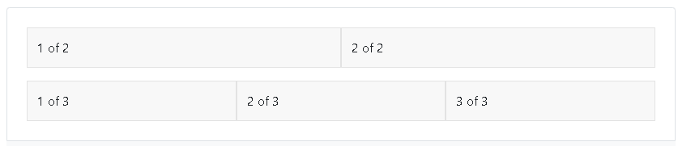
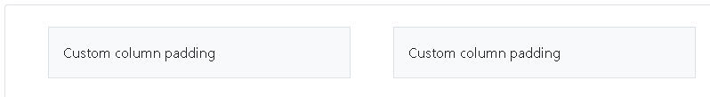

# Bootstrap Basics

Até o momento, nós passamos pelo básico de todos os componentes necessário para o desenvolvimento de páginas web. Vimos como construir páginas com `HTML`, como estilizar elementos com `CSS` e como adicionar comportamentos e se comunicar com o servidor com `Javascript`. Porém, tudo o que vimos de frontend foram apenas fundamentos de cada uma das ferramentas necessárias para se criar aplicações web.

No desenvolvimento web frontend é muito comum que programadores optem por um `framework` (biblioteca/ferramenta) que os forneçam muitas coisas já prontas e acelerem a velocidade de desenvolvimento. Atualmente as ferramentas mais famosas são `react` e `angular` que transformam completamente a fora de se desenvolver páginas web. Porém, aqui vamos introduzir uma biblioteca mais simples que não muda o paradigma de desenvolvimento, mas nos fornece uma serie de componentes novos e estilos prontos que podemos aproveitar. Esta biblioteca se chama `Bootstrap`.

## Introdução

O [`Bootstratp`](https://getbootstrap.com/docs/3.4/) é um framework `HTML`, `CSS` e `JS` focado na criação de aplicações web responsivas e comfoco na experiencia mobile. Ele fornece componentes `HTML` e `CSS` prontos que funcionam bem e se integram ao `JS`.

Para criar uma página que use os componentes do `Bootstrap` apenas precisamos referenciar os seus arquivos `CSS` e `JS`, como no exemplo abaixo.

```html
<!doctype html>
<html lang="en">
  <head>
    <!-- Required meta tags -->
    <meta charset="utf-8">
    <meta name="viewport" content="width=device-width, initial-scale=1">

    <!-- Bootstrap CSS -->
    <link href="https://cdn.jsdelivr.net/npm/bootstrap@5.0.2/dist/css/bootstrap.min.css" rel="stylesheet" integrity="sha384-EVSTQN3/azprG1Anm3QDgpJLIm9Nao0Yz1ztcQTwFspd3yD65VohhpuuCOmLASjC" crossorigin="anonymous">

    <title>Hello, world!</title>
  </head>
  <body>
    <h1>Hello, world!</h1>

    <!-- Optional JavaScript; choose one of the two! -->

    <!-- Option 1: Bootstrap Bundle with Popper -->
    <script src="https://cdn.jsdelivr.net/npm/bootstrap@5.0.2/dist/js/bootstrap.bundle.min.js" integrity="sha384-MrcW6ZMFYlzcLA8Nl+NtUVF0sA7MsXsP1UyJoMp4YLEuNSfAP+JcXn/tWtIaxVXM" crossorigin="anonymous"></script>

    <!-- Option 2: Separate Popper and Bootstrap JS -->
    <!--
    <script src="https://cdn.jsdelivr.net/npm/@popperjs/core@2.9.2/dist/umd/popper.min.js" integrity="sha384-IQsoLXl5PILFhosVNubq5LC7Qb9DXgDA9i+tQ8Zj3iwWAwPtgFTxbJ8NT4GN1R8p" crossorigin="anonymous"></script>
    <script src="https://cdn.jsdelivr.net/npm/bootstrap@5.0.2/dist/js/bootstrap.min.js" integrity="sha384-cVKIPhGWiC2Al4u+LWgxfKTRIcfu0JTxR+EQDz/bgldoEyl4H0zUF0QKbrJ0EcQF" crossorigin="anonymous"></script>
    -->
  </body>
</html>
```

Aqui existem 2 linhas importantes, a que importa o css e a que importa o javascript.

```html
<link href="https://cdn.jsdelivr.net/npm/bootstrap@5.0.2/dist/css/bootstrap.min.css" rel="stylesheet" integrity="sha384-EVSTQN3/azprG1Anm3QDgpJLIm9Nao0Yz1ztcQTwFspd3yD65VohhpuuCOmLASjC" crossorigin="anonymous">

<script src="https://cdn.jsdelivr.net/npm/bootstrap@5.0.2/dist/js/bootstrap.bundle.min.js" integrity="sha384-MrcW6ZMFYlzcLA8Nl+NtUVF0sA7MsXsP1UyJoMp4YLEuNSfAP+JcXn/tWtIaxVXM" crossorigin="anonymous"></script>
```

## Fundamentos

O framwork `Bootstrap` fornece inúmeras funcionalidades, porém vamos estudar alguns fundamentos e componentes mais relevantes. A primeira coisa que é interessante entender é como podemos manipular o Layout com o sistema de `Containers` e `Grids`.

## Containers e Grids

Vamos tentar contruir um sistema simples em que queremos dividir a nossa página em 3 colunas. Para isso faremos usos de algumas classes de css do bootstrap, como `container`, `row` e `column`.

```html
<!doctype html>
<html lang="en">
  <head>
    <!-- Required meta tags -->
    <meta charset="utf-8">
    <meta name="viewport" content="width=device-width, initial-scale=1">

    <!-- Bootstrap CSS -->
    <link href="https://cdn.jsdelivr.net/npm/bootstrap@5.0.2/dist/css/bootstrap.min.css" rel="stylesheet" integrity="sha384-EVSTQN3/azprG1Anm3QDgpJLIm9Nao0Yz1ztcQTwFspd3yD65VohhpuuCOmLASjC" crossorigin="anonymous">

    <title>Hello, world!</title>
  </head>
  <body>
    <div class="container">
        <div class="row">
            <div class="col">
                Column
            </div>
            <div class="col">
                Column
            </div>
            <div class="col">
            Column
            </div>
        </div>
    </div>

    <script src="https://cdn.jsdelivr.net/npm/bootstrap@5.0.2/dist/js/bootstrap.bundle.min.js" integrity="sha384-MrcW6ZMFYlzcLA8Nl+NtUVF0sA7MsXsP1UyJoMp4YLEuNSfAP+JcXn/tWtIaxVXM" crossorigin="anonymous"></script>
  </body>
</html>
```

Percebam que este layout com divs criou 3 colunas para nós, porém o mais interessante é que se mudarmos o tramanho da janela as colunas se ajustam ao novo tamanho, ou seja, elas são responsivas. Isso se dá por causa da classe `container`.

Existem 3 classes que podemos usar referentes ao `container`:
- `.container`: ajusta a largura máxima de acordo com a janela.
- `.container-fluid`: deixa a largura máxima como 100% a cada `breakpoint`.
- `.container-{breakpoint}`: seta o tamanho como 100% da janela até o limite do `breakpoint`.

> [!IMPORTANT] 
> Breakpoints são apenas tamanhos pre-determinados de devices, como `sm`, `md`, `lg` representam pequeno, médio e grande.

Já o sistema de `Grid` é realizado através das classes `.row` e `.column` e pode ser usado para produzir diferentes Layouts. Vamos tentar reproduzir o Grid abaixo.



Repare que a primeira linha do grid tem 2 colunas com o mesmo tamanhoe  a segunda linha contém 3 colunas do mesmo tamanho. Para montar este layout que poderia dar um pouco de trabalho em `HTML` e `CSS` puo, podemos fazer o seguinte:

```html
<div class="container">
  <div class="row">
    <div class="col">
      1 of 2
    </div>
    <div class="col">
      2 of 2
    </div>
  </div>
  <div class="row">
    <div class="col">
      1 of 3
    </div>
    <div class="col">
      2 of 3
    </div>
    <div class="col">
      3 of 3
    </div>
  </div>
</div>
```

Porém também é possível definir o tamanho de colunas, por exemplo podemos fixar o tamanho para as colunas do meio e não perderemos a responsividade nas colunas restantes.

```html
<div class="container">
  <div class="row">
    <div class="col">
      1 of 3
    </div>
    <div class="col-6">
      2 of 3 (wider)
    </div>
    <div class="col">
      3 of 3
    </div>
  </div>
  <div class="row">
    <div class="col">
      1 of 3
    </div>
    <div class="col-5">
      2 of 3 (wider)
    </div>
    <div class="col">
      3 of 3
    </div>
  </div>
</div>
```

As classes `.col-<n>` representam o tamanho da coluna relativo as outras, por exemplo `.col-5` significa que ela é 5 vezes o tamanho de 1 coluna padrão.

Por fim, é possível simplificar o `html` para griar grids usando a classe `.row-cols-<n>`. Assim não precisamos declarar uma div para cada nova linha.

```html
<div class="container">
  <div class="row row-cols-2">
    <div class="col">Column</div>
    <div class="col">Column</div>
    <div class="col">Column</div>
    <div class="col">Column</div>
  </div>
</div>
```

O exemplo acima cria uma layout que cada linha só pode conter 2 colunas, logo o `bootstrap` identifica que temos mais que 2 colunas e cria automáticamente mais 1 linha. Para mais informações sobre veja a [documentação](https://getbootstrap.com/docs/5.0/layout/grid/).

Também é possível criar espaçamentos entre colunas usando `gutters`, representados pela classe `.gx-<n>` para espaçamento horizontal e `.gy-<n>` para espaçamento vertical. Por exemplo se quisermos criar algo similar a imagem a seguir, podemos usar o código abaixo.



```html
<div class="container px-4">
  <div class="row gx-5">
    <div class="col">
     <div class="p-3 border bg-light">Custom column padding</div>
    </div>
    <div class="col">
      <div class="p-3 border bg-light">Custom column padding</div>
    </div>
  </div>
</div>
```

## Imagens Responsivas

É possível adicionar imagens e fazer com que elas se redimensionem automaticamente com a classe `.img-fluid`.

```html

```

## Tabelas

Tabelas no bootstrap são representadas pela classe `.table`, e ela deve ser aplicada ao element `<table>` do html.

```html
<table class="table">
  <thead>
    <tr>
      <th scope="col">#</th>
      <th scope="col">First</th>
      <th scope="col">Last</th>
      <th scope="col">Handle</th>
    </tr>
  </thead>
  <tbody>
    <tr>
      <th scope="row">1</th>
      <td>Mark</td>
      <td>Otto</td>
      <td>@mdo</td>
    </tr>
    <tr>
      <th scope="row">2</th>
      <td>Jacob</td>
      <td>Thornton</td>
      <td>@fat</td>
    </tr>
    <tr>
      <th scope="row">3</th>
      <td colspan="2">Larry the Bird</td>
      <td>@twitter</td>
    </tr>
  </tbody>
</table>
```

Até aqui parece um pouco mais do mesmo mas reparem que agora temos elementos html diferentes como `<thead>` e `<tbody>` e os atributos `scope` que definem linhas e colunas e o `colspan` que permite juntarmos colunas.

As tabelas do bootstramp podem ser estilizadas de diversas maneiras, por exemplo, podemos transformar a tabela em um modelo `dark` aplicando a classe `.table-dark`, que pode ser aplicado a nível da tabela `<table>`, linha `<tr>` ou coluna `<td>`.

```html
<table class="table table-dark">
  <thead>
    <tr>
      <th scope="col">#</th>
      <th scope="col">First</th>
      <th scope="col">Last</th>
      <th scope="col">Handle</th>
    </tr>
  </thead>
  <tbody>
    <tr>
      <th scope="row">1</th>
      <td>Mark</td>
      <td>Otto</td>
      <td>@mdo</td>
    </tr>
    <tr>
      <th scope="row">2</th>
      <td>Jacob</td>
      <td>Thornton</td>
      <td>@fat</td>
    </tr>
    <tr>
      <th scope="row">3</th>
      <td colspan="2">Larry the Bird</td>
      <td>@twitter</td>
    </tr>
  </tbody>
</table>
```

Também é possível criar tabelas listradas, que melhoram a visualização de cada linha intercalando suas cores. Basta usar a classe `.table-striped`.

```html
<table class="table table-striped">
  <thead>
    <tr>
      <th scope="col">#</th>
      <th scope="col">First</th>
      <th scope="col">Last</th>
      <th scope="col">Handle</th>
    </tr>
  </thead>
  <tbody>
    <tr>
      <th scope="row">1</th>
      <td>Mark</td>
      <td>Otto</td>
      <td>@mdo</td>
    </tr>
    <tr>
      <th scope="row">2</th>
      <td>Jacob</td>
      <td>Thornton</td>
      <td>@fat</td>
    </tr>
    <tr>
      <th scope="row">3</th>
      <td colspan="2">Larry the Bird</td>
      <td>@twitter</td>
    </tr>
  </tbody>
</table>
```

Estes estilos podem ser combinado, como por exemplo em uma tabela listrada que quando o usuário passa o mouse em cima de uma linha ela se destaca.

```html
<table class="table table-striped table-hover">
  <thead>
    <tr>
      <th scope="col">#</th>
      <th scope="col">First</th>
      <th scope="col">Last</th>
      <th scope="col">Handle</th>
    </tr>
  </thead>
  <tbody>
    <tr>
      <th scope="row">1</th>
      <td>Mark</td>
      <td>Otto</td>
      <td>@mdo</td>
    </tr>
    <tr>
      <th scope="row">2</th>
      <td>Jacob</td>
      <td>Thornton</td>
      <td>@fat</td>
    </tr>
    <tr>
      <th scope="row">3</th>
      <td colspan="2">Larry the Bird</td>
      <td>@twitter</td>
    </tr>
  </tbody>
</table>
```

Existem diversas possibilidades e formatos de tabelas, para mais informações veja a [documentação](https://getbootstrap.com/docs/5.2/content/tables/).

Na próxima aula veremos como trabalhar com `<form>` do bootstrap.
