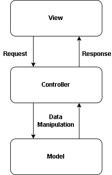

# Desenvolvimento Web - C# e MVC

`ASP.NET Core` é um framework de desenvolvimento web da Microsoft, moderna, de código aberto e multiplataforma. É usada para construir aplicativos web e APIs dinâmicas, de alto desempenho e altamente escaláveis.

`MVC` (`Model-View-Controller`) é um padrão de arquitetura que separa um aplicativo em três componentes principais:

- `Model` (Modelo): Representa a lógica dos dados do aplicativo. Modelos são usados para gerenciar dados e lógica de negócios.
- `View` (Visão): É responsável pela exibição da interface do usuário. As Views recebem dados do Model e os exibem para o usuário.
- `Controller` (Controlador): Atua como um intermediário entre Model e View. Ele escuta as entradas dos usuários, processa essas entradas através do Model e retorna a View apropriada.

## Relacionamento entre MVC e o Modelo Cliente-Servidor

O padrão `MVC` é fortemente relacionado ao modelo cliente-servidor, que é a base da arquitetura da web moderna. 
MVC no Contexto Cliente-Servidor:

- `Cliente` (View): Envia requisições ao servidor e exibe os dados recebidos.
- `Servidor` (Controller e Model): Processa as requisições, manipula dados (Model) e retorna respostas formatadas para o cliente (View).

    

### Exemplo Prático

Imagine um sistema simples de gerenciamento de biblioteca. 
A classe Book que representa os dados de um livro é a `Model`, a `View`
é uma página `HTML` que exibe informações sobre livros e a `Controller`
a classe `BooksController` que lida com requisições do usuário (como listar livros, adicionar um novo livro) 
e interage com o Book model para retornar a `View` apropriada.

Essa separação facilita a manutenção e a escalabilidade do aplicativo, 
permitindo que diferentes partes sejam desenvolvidas e modificadas 
de forma independente.

## Client-Server e APIs

Tirando vantagem dessa modularidade, criaremos uma api com `C#`, onde não nos preocuparemos com a `View`.

Uma api representa o `server` do modelo `cliente-servidor`. E usaremos `Models` e `Controllers` do aspnet core para realizar isso. Em termos gerais uma api recebe requisições e devolve dados para o client. Para esta tarefa utilizaremos o padrão `REST` para a api.

`REST` (Representational State Transfer) é um estilo de arquitetura para sistemas distribuídos, como a web. APIs RESTful seguem um conjunto específico de princípios que permitem a comunicação entre um cliente e um servidor.

### Princípios do REST

Recursos: Em `REST`, tudo é tratado como um recurso. Um recurso pode ser qualquer coisa, como um usuário, uma postagem de blog ou um produto. Cada recurso é identificado por um `URL` único.

Para o client interagir com um recurso este solicitará a `URL` necessária através do verbo `HTTP` correto. Os principais verbos são:

- `GET`: Recupera dados de um recurso.
- `POST`: Cria um novo recurso.
- `PUT`: Atualiza um recurso existente.
- `DELETE`: Remove um recurso.

### Exemplo de API REST

Vamos supor que estamos criando uma `API REST` para gerenciar usuários. Aqui estão alguns exemplos de endpoints e suas operações:

- `GET` `/users`: Recupera a lista de todos os usuários.
- `GET` `/users/{id}`: Recupera um usuário específico pelo ID.
- `POST` `/users`: Cria um novo usuário. Os dados do novo usuário são enviados no corpo da requisição.
- `PUT` `/users/{id}`: Atualiza os dados de um usuário específico.
- `DELETE` `/users/{id}`: Remove um usuário específico.